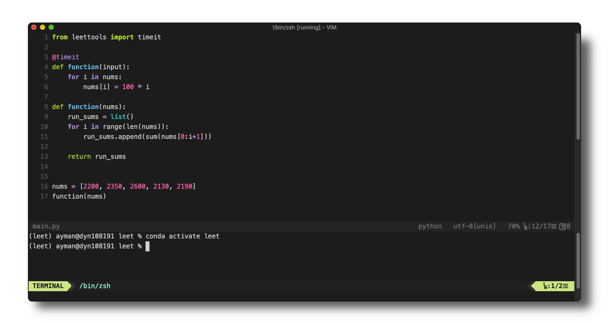

# Leettools - An Ultra Light-Weight VIM-Based IDE



## DESCRIPTION
Leettools is a collection of scripts and vim configurations for setting up an ultra-light vim-based IDE. I use this mainly for solving leetcode.com problems in a local environment such that I have access to all custom keybindings and VIM configurations.

## USAGE
The `leet` command will create a copy of the leet environment template and open MacVim. The `timeit` function from the leettools library is imported, and can be used as a decorator to time the main problem function.

```python
@timit
@timeit
def function(nums):
	for num in nums
	return f'{num} is a cool number!'
```

Pressing **⌘ + '** will run the function as many times as possible in `0.001` seconds and return mean runtime and minimum runtime.
```bash
function ran 519 times | mean time = 1.5665e-06 s | min time = 7.15255737e-07 s
```


## REQUIREMENTS
* MacVim (installed via brew)
* Vundle: davidhalter/jedi-vim
* Conda for virtual environment

## INSTALLATION
