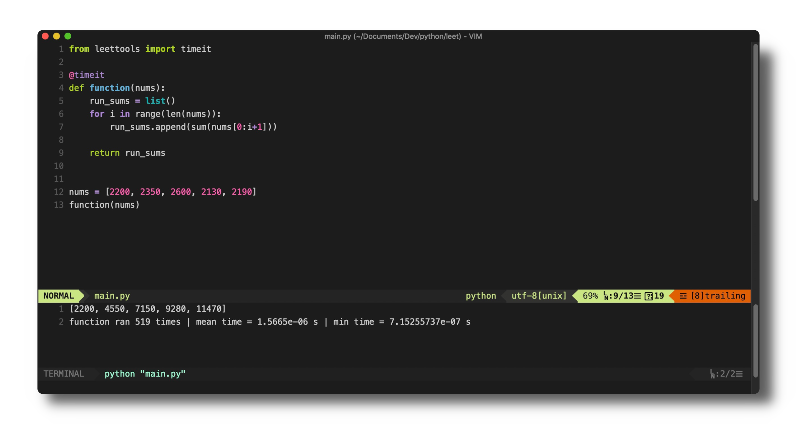

# Leettools - An Ultra Light-Weight VIM-Based IDE



## DESCRIPTION
Leettools is a collection of scripts and vim configurations for setting up an ultra-light vim-based IDE. I use this mainly for solving leetcode.com problems in a local environment so that I have access to all my custom keybindings and VIM configurations.

## USAGE
Typing the `leet` command into your terminal will create a copy of the leet environment template and open MacVim with a terminal mode buffer. The `timeit` function from the leettools library is imported, and can be used as a decorator to time a given function.

```python
@timeit
def function(nums):
	for num in nums
	return f'{num} is a cool number!'
```

Pressing **⌘ + '** will run the function as many times as possible in `0.001` seconds and return mean and minimum runtimes.
```bash
function ran 519 times | mean time = 1.5665e-06 s | min time = 7.15255737e-07 s
```


## REQUIREMENTS
* MacVim (installed via brew)
* Vundle: davidhalter/jedi-vim
* Conda for virtual environment
* `leettools.py` (download a copy of this file from this repo)

## INSTALLATION
* Some working version of Python
* zsh/bash alias to create a copy of the leet template environment.
* A copy of `leettools.py` for @timeit decorator and other functionalities.